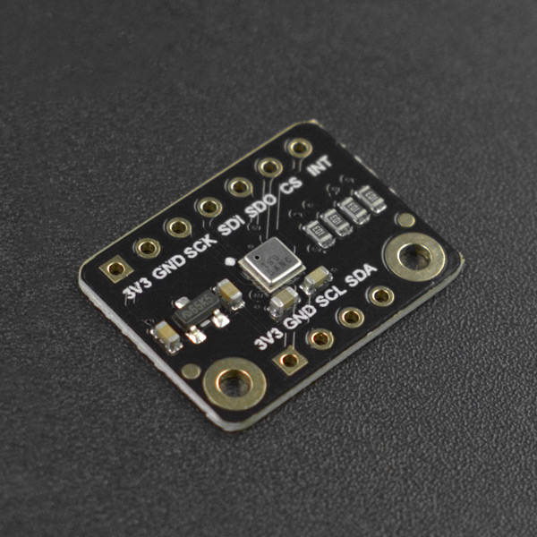

# DFRobot_RGBButton
* [中文版](./README_CN.md)





## Product Link (https://www.dfrobot.com/)
    SKU: DFR0991


## Table of Contents

* [Summary](#summary)
* [Installation](#installation)
* [Methods](#methods)
* [Compatibility](#compatibility)
* [History](#history)
* [Credits](#credits)


## Summary

* 


## Installation

To use the library, first download the library file, paste it into the directory you specified, then open the Examples folder and run the demo in that folder.


## Methods

```python

```


## Compatibility

* RaspberryPi Version

| Board        | Work Well | Work Wrong | Untested | Remarks |
| ------------ | :-------: | :--------: | :------: | ------- |
| RaspberryPi2 |           |            |    √     |         |
| RaspberryPi3 |           |            |    √     |         |
| RaspberryPi4 |     √     |            |          |         |

* Python Version

| Python  | Work Well | Work Wrong | Untested | Remarks |
| ------- | :-------: | :--------: | :------: | ------- |
| Python2 |     √     |            |          |         |
| Python3 |     √     |            |          |         |


## History

- 2022/05/17 - Version 1.0.0 released.


## Credits

Written by qsjhyy(yihuan.huang@dfrobot.com), 2022. (Welcome to our [website](https://www.dfrobot.com/))

